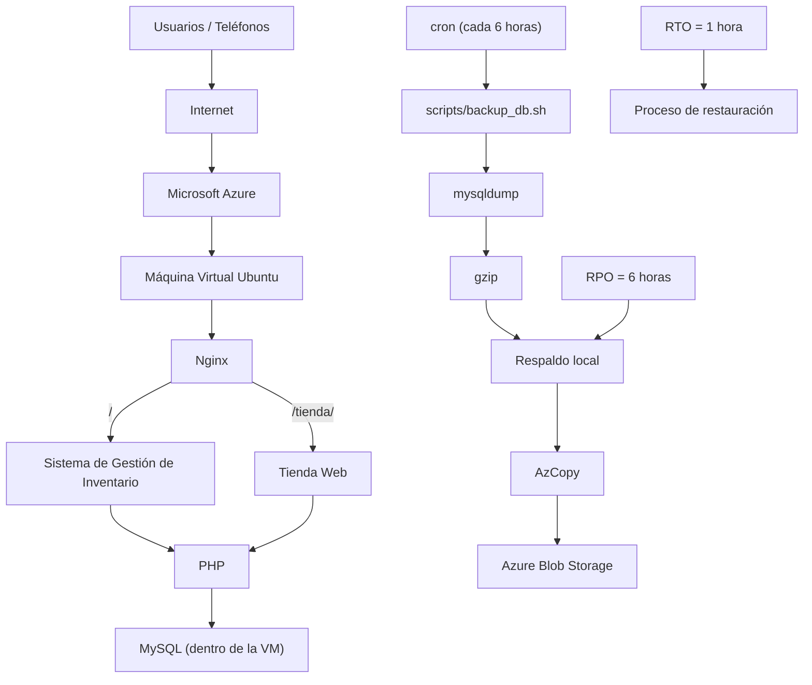

# Arquitectura Revisada

Documento que describe la arquitectura final del sistema tras el **Proyecto 2**.
Explica cómo la solución evoluciona desde un frontend estático (Proyecto 1)
hasta una aplicación real integrada, y detalla su diagrama, flujo de operación,
justificación de servicios, disponibilidad y acceso móvil.

---

## 1. Descripción general

El **Proyecto 2** es una evolución del **Proyecto 1**.

En el Proyecto 1 se tenía principalmente un **frontend de tienda** desplegado
en Azure: una tienda de equipos de cómputo con tarjetas de producto, precios y
un carrito de compras escrito a mano en HTML, CSS y JavaScript.

En el Proyecto 2 la solución evoluciona a una **aplicación real integrada**:

- **Tienda de equipos** de cómputo (frontend).
- **Sistema de Gestión de Inventario** (módulo administrativo).
- **Backend** PHP que procesa las operaciones.
- **MySQL** administrado por el grupo dentro de la VM.
- **Acceso móvil** (diseño responsivo).
- **Respaldo automatizado** de la base de datos.
- **Azure Blob Storage** como copia externa de los respaldos.
- **Recuperación ante fallos** (RPO = 6 horas, RTO = 1 hora).

La **tienda** y el **inventario** son dos módulos de **UNA MISMA SOLUCIÓN** que
comparten la misma base de datos MySQL. La tienda lee los productos de la tabla
`articulos`, y el inventario permite registrar, consultar y actualizar esos
mismos artículos. Un cambio hecho desde el módulo administrativo se refleja en
la tienda al recargar la página.

La tienda desplegada (`/var/www/inventario/tienda/`) está actualizada: obtiene
los **8 productos** directamente desde MySQL, muestra el **icono correspondiente
al tipo de cada producto**, presenta el **precio** y la **disponibilidad**
(existencias), y conserva el **carrito de compras** funcional.

---

## 2. Diagrama de arquitectura

---

## 3. Flujo de operación

1. El usuario entra a la aplicación desde el **navegador** o el **teléfono**.
2. **Nginx** recibe las solicitudes.
3. **PHP** procesa las operaciones.
4. El **Sistema de Gestión de Inventario** registra, consulta o actualiza
   artículos.
5. **MySQL** almacena los datos.
6. La **tienda** consulta esa misma base de datos.
7. Si cambia el precio, el nombre o la cantidad desde el inventario, la tienda
   refleja el cambio al recargar.
8. **cron** ejecuta el respaldo automático **cada 6 horas**.
9. El respaldo se crea con **mysqldump**.
10. Se comprime con **gzip**.
11. Se conserva **localmente** en la VM.
12. **AzCopy** envía el respaldo a **Azure Blob Storage**.

---

## 4. Justificación de los servicios

### Azure VM
Se utiliza porque el Proyecto 2 exige que la empresa conserve el **control
administrativo del motor de base de datos**. La VM permite instalar, configurar
y administrar MySQL directamente.

### MySQL en VM
No se utiliza una **base de datos gestionada** (PaaS) debido a la **restricción
contractual** indicada en el escenario del Proyecto 2: la empresa debe
administrar su propio motor de base de datos dentro de la infraestructura.

### Nginx
Servidor web **ligero** y de alto rendimiento utilizado para publicar la
aplicación (tienda y Sistema de Gestión de Inventario) junto con PHP.

### PHP
Backend **sencillo** y ampliamente conocido que gestiona el inventario y la
conexión con MySQL mediante PDO.

### Azure Blob Storage
Almacenamiento **externo de objetos** que evita que los respaldos dependan
únicamente de la misma VM, protegiendo los datos ante fallos de infraestructura.

### AzCopy
Herramienta de línea de comandos de Azure utilizada para **transferir
automáticamente** los respaldos generados hacia Azure Blob Storage.

### cron
Automatiza la **ejecución periódica** del respaldo cada 6 horas, sin intervención
manual.

### GitHub
Repositorio de **código y control de versiones** del sistema.

---

## 5. Disponibilidad

La solución contempla las siguientes medidas para asegurar la disponibilidad y
la recuperación de los datos:

- **Respaldo automático** cada **6 horas** mediante cron.
- **Copia local** del respaldo en la VM.
- **Copia externa** en **Azure Blob Storage** mediante AzCopy.
- **Prueba real de restauración** realizada y verificada.
- **RPO = 6 horas**: pérdida máxima aceptable es lo generado desde el último
  respaldo (máximo 6 horas de operación).
- **RTO = 1 hora**: tiempo máximo estimado para restablecer el servicio completo
  ante un desastre.

---

## 6. Acceso móvil

El **Sistema de Gestión de Inventario** y la **tienda** tienen **diseño
responsivo** y fueron **probados desde teléfono**. Los transportistas o
usuarios móviles pueden consultar y actualizar el inventario desde un
dispositivo móvil, y la tienda se visualiza correctamente en pantallas pequeñas.