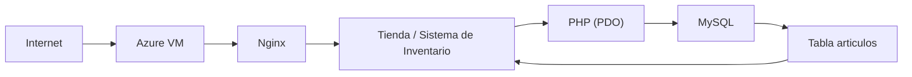

# Integración Tienda — Inventario

Documento de arquitectura que explica cómo la **tienda del Proyecto 1**
y el **Sistema de Gestión de Inventario del Proyecto 2** pasan a ser dos
módulos de **UNA MISMA SOLUCIÓN** que comparten la misma base de datos.

---

## Proyecto 1

Frontend de una tienda de equipos de cómputo desplegado en Azure.

- Originalmente mostraba productos **escritos a mano** (código `proyecto1.js`).
- Incluía tarjetas de producto, precios, carrito de compras y diseño responsivo.
- Archivos originales (se conservan, no se modifican):
  - `proyecto1.html`
  - `proyecto1.css`
  - `proyecto1.js`

## Proyecto 2

La solución evoluciona incorporando:

- Gestión real del inventario (registrar / consultar / actualizar artículos).
- MySQL administrado dentro de la VM como fuente única de datos.
- Acceso móvil (diseño responsivo).
- Disponibilidad y respaldo del sistema.

La aplicación de inventario vive en `index.php` y usa `config.php` para
conectarse a MySQL de forma segura (sin credenciales en Git).

> En esta etapa la tienda del Proyecto 1 deja de mostrar productos
> fijos y pasa a leerlos del **mismo** inventario.

## Relación entre módulos

| Componente        | Rol                                                              |
| ----------------- | ---------------------------------------------------------------- |
| **Tienda**        | Interfaz de consulta de productos (lectura del inventario).       |
| **Inventario**    | Módulo administrativo (registrar, consultar, actualizar).         |
| **MySQL**         | Fuente única de datos para ambos módulos (tabla `articulos`).     |
| **Nginx**         | Servidor web que publica ambos módulos.                           |
| **VM Azure**      | Infraestructura donde se ejecutan la aplicación y la base de datos. |

### Cómo obtiene la tienda los datos

`tienda/index.php`:

1. Carga `../config.php` (credenciales fuera de Git).
2. Abre una conexión **PDO** a la misma base `inventario`.
3. Ejecuta un `SELECT` de solo lectura sobre `articulos`.
4. Renderiza las tarjetas de producto desde PHP (con `htmlspecialchars`
   para evitar XSS) y además entrega los datos al carrito vía
   `window.PRODUCTOS` (JSON codificado de forma segura).

Como la tienda **consulta la tabla real**, cualquier cambio de nombre,
descripción, precio o cantidad hecho desde el inventario se refleja
al recargar la tienda.

### Diagrama de arquitectura

La tienda y el inventario **convergen sobre la misma base de datos**:
cambios desde el módulo administrativo se ven de inmediato en la tienda.

---

## Cómo probar la integración

1. Abrir el **Sistema de Gestión de Inventario** (`index.php`).
2. Editar un artículo y cambiar su precio o cantidad.
3. Guardar los cambios.
4. Abrir o recargar la **tienda** (`tienda/index.php`).
5. Verificar que el nuevo precio/cantidad aparezca de inmediato.